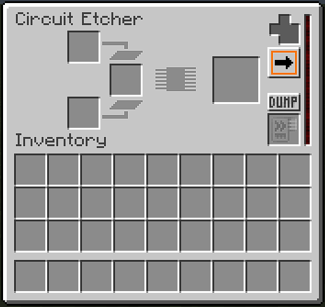
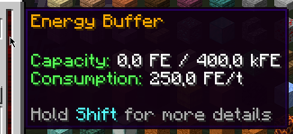
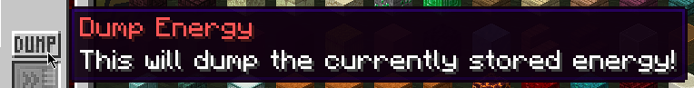
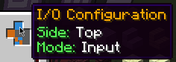
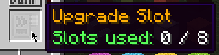
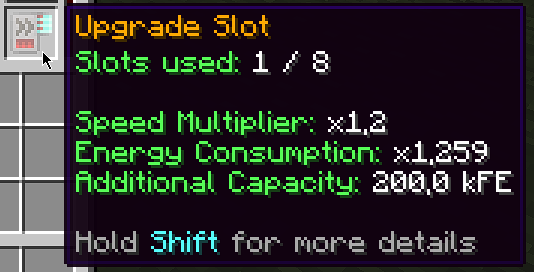
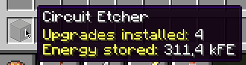
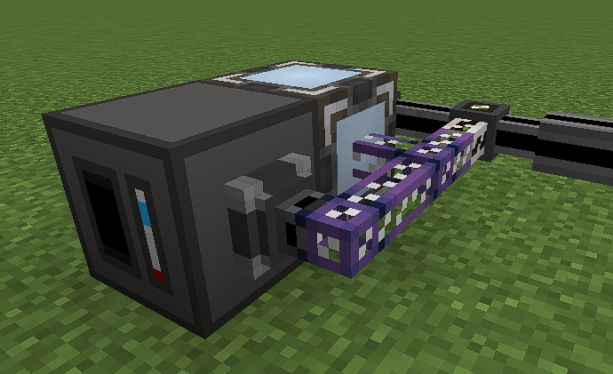

# **Functionality Guide**
This page shows the basic functionality of the currently implemented processing machines.

### **Interface**
Each processor machine has pretty much the same interface. 
The only differences are the input slot amounts and the slot positions as well as the progress bars.

### **Upgrades**
All processors can be upgraded by putting Applied Energistics 2 Acceleration Cards into the upgrade slot. 
Each upgrade will speed up processing of the machine and also increase the energy buffer capacity at the cost
of a higher energy consumption. 
All of these values can be tweaked in the config per processor.

### **Input Slots**
When you have a processor with multiple slots, you will quickly see that the insertion behavior of items is a little odd. 
That's because each input slot only accepts a specific item of a recipe to make automation easier.

### **I/O Configuration**
Each processor supports I/O configuration. I/O stands for input-output. 
By default, each side of the processor is set to a mode called `None` which basically means this side can't accept or output items.

You can change the I/O configuration by clicking the buttons in the upper right corner of the interface. 
It will cycle through all 4 modes `None`, `Input`, `Output` and `I/O` (both) but you can always quickly reset the
side by shift-clicking the button for it.

### **Saved Values**
When breaking a processor, all items inside the input slots and the output slot will be dropped. 
The energy, however, is stored as well as the upgrades and the I/O configuration.

A processor item with these saved values is not able to form a stack with another processor of the same type. 
In order to make them stackable again, place the processor, remove the upgrades, reset the I/O configuration and click the
`Dump` button to empty the energy buffer.

### **Extended Information**
When a tooltip has the line `Press Shift for more details`, you will be able to either see more information which takes up much space
or the values are shown in an extended way.

Energy amounts are automatically annotated with a suffix which makes the number as small as possible. 
But if you want to see the whole number, this is a good option to do so.

---

Let's take the Circuit Etcher as an example. 
The Circuit Etcher is basically an advanced Inscriber but with the huge benefit of being able
to process raw materials. 
This means that no other Inscribers are needed to process Silicon for example.

---

The GUI (also called Screen) has some basic elements which are now shown in detail.

**Energy Buffer**

The red bar on the right side of the screen is the energy buffer. 
It fills up when energy is given to the processor.

The capacity of the energy storage depends on the processor type but it's adjustable in the config.

When hovering over the energy bar, you will get a tooltip like in the screenshot which gives you a
brief overview of the current values. 
Since the capacity and the energy consumption depends on the amount of upgrades you place inside
the processor, these values will be a good way to keep track of the current status of the processor.

---

**Dump Button**

Pretty self-explanatory, the `Dump` button will empty the current energy buffer. 
Since the energy is saved to the item when breaking a processor, this can be handy to make processors of the
same type stackable again.

---

**I/O Configuration**

The I/O configuration consists of 6 fields with each representing one side of the machine. 
Because it's well known that some players have issues with these types of layouts for configuration,
there are tooltips where you can see which side is currently getting configured as well as the current mode.

The 4 modes are:
- NONE - gray
- INPUT - blue
- OUTPUT - orange
- I/O (input & output) - blue/orange

---

**I/O Configuration Example**

This is an example of an I/O configuration. 
That means that the processor is able to accept items from its top, output items to its left side
and both on the bottom side.

---

**Upgrade Slot**

The upgrade slot is the place where Acceleration Cards go to speed up the processor. 
Upgrading also increases the maximum energy capacity but with each upgrade you will get increased energy consumption.

The tooltip shows you how many upgrades can be placed in the slot which is also a configurable value.

---

**Upgrade Filled**

When placing an upgrade inside the upgrade slot more info is shown in the tooltip. 
It will show you the current multipliers and changed values for the upgrade amount you have.

---

**Item Tooltip**

When breaking a processor, some information are saved to the item which is dropped. 
There are tooltips to see which information was saved to identify the processor.

---

**Automation**

Because there is no auto-extraction yet, you have to extract from the processors yourself. 
If you want to automate a processor with the help of a ME-System, this is a good way to do it.

The ME-Interface is connected to the system and adjacent to the processor you want to automate. 
Then, an Import Bus is attached to the processor and connected to the Interface with a cable.

It's really important that the cable with the Import Bus does not connect to your main system. 
You can achieve that by using Quartz Fiber for example.

If it's not working, make sure you have the I/O configuration properly adjusted to the setup and that
the processor has energy.
